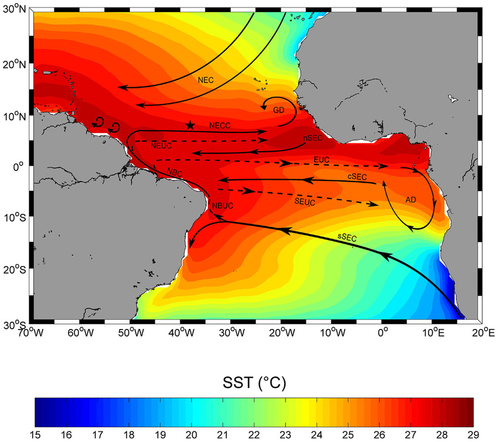
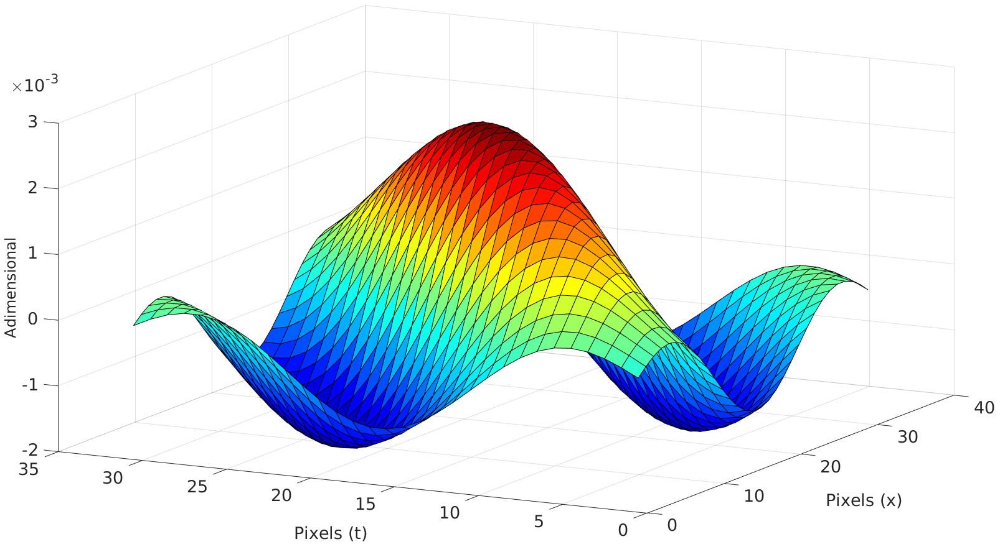

# PHYSAT_data_processing
 
## Info
These codes were used in my honour's thesis "1st mode baroclinic Rossby waves modify the composition of Phytoplancton Functional Groups".

Georeferenced data such as satellite remote sensing imagery can usually be processed in a number of ways: spatially/temporally interpolated, sliced or rearranged.
This imagery is usually interpreted as maps of a variable (e.g. Sea Surface Temperature or Absolute Dynamic Topography) that are in turn a function of 3 dimensions:
latitude, longitude and time, as in this snapshot of SSTs in the south atlantic below:

Even when a "vertical" dimension such as Depth comes into the mix, it is customary to imagine a spherical shell upon which the variable is plotted.

In this project, however, instead of the usual lat-long snapshots of a certain variable, the focus was on the temporal evolution of said variable _in_ _time_, _for_ _a_ _certain_ _location_.
Hovmöller diagrams are particularly useful when analyzing oceanic phenomena whose variability is roughly zonal i.e. confined to a single latitude. Here on the right we have an example
of altimetry data for a single latitude (30ºS) on the Atlantic Ocean. The diagonal features are Rossby waves, identified as westward-travelling crests and throughs that cross the South
Atlantic after several months or even years. So how do we make those?

The `PHYSAT_cuboid.m` matlab code runs through a folder of several georeferenced netcdf global data files (arranged by date) and "stack" these lat-long maps to form a cube (hence the name),
where the time variable can be understood as a vertical "z" axis. This cube is then sliced on the x-z plane i.e. the longitude-time plane for a specific latitude. Lo and behold,
we obtain a Hovmöller / zonal-temporal diagram.

<h3 align="center"> 
But *what* - you ask me, furiously - is the *point*?
</h3>

 
I will leave below the abstract from my thesis, as it provides a necessary background before we can move on:
  

<h4 align="center"> 
Phytoplankton Functional Types (PFT's) play a variety of roles on biogeochemical cycles through positive and negative feedback mechanisms that influence a myriad of physical
and biological processes; moreover, these processes comprise a large range of both spatial and temporal scales. The study of such cycles, albeit complex, is imperative for
the development of robust and prognostic climate models. On large-scale, sub-inertial processes comprehend the largest parcel of the oceanic energy spectrum and include the
most energetic physical phenomena. Part of this variability is translated into deterministic linear phenomena: Rossby waves of the first baroclinic mode.
These waves carry with them a chlorophyll signal which can be detected by orbital sensors. Remote sensing techniques allow us to ascertain the bio-optical state of the water
collumn, providing an indirect measure of the primary productivity in the ocean. Bio-optical algorithms have been developed in the past few decades that enable the
discrimination of PFT's based on the radiance anomalies induced by the presence of accessory pigments, representing second order variations of the normalized water-leaving
radiance, masked by the presence of chlorophyll-a, an ubiquitous pigment in fitoplanctonic organisms. On this project I use the PHYSAT bio-algorithm's database
(see Alvain2005) to investigate correlations with altimetry data on the South Atlantic Ocean and to determine if these waves can modify the composition of phytoplanktonic
communities because of their propagation.
</h4>

To sum it up:
- 1 ) I imported about 15 years of global altimetric daily data on a bunch of separate files.
	- 1.1) Merged these files temporally (rearranging the data on a cube) and extracted the south atlantic.
	- 1.2) "Sliced" the cubes to obtain Hovmöller diagrams in latitudes of interest (those with strong signals in the low-frequency energy spectrum)
	- 1.3) Cleaned the data by filtering the so called "long term" component (in which the insidious slow heating of our planet throughout the decades is translated into
altimetric data through thermosteric sea-level rise.
	- 1.4) Extracted the sazonal component through a gaussian filter (to emulate the effect of seasons on the thermosteric effect)
	- 1.5) Applied a chain of bidimensional Finite Impulse Response filters to extract Rossby waves (see Polito & Liu 2003 for more info), or, as I prefer to call them: _sombrero_ _filters_:

- 2 ) In parallel, I organized PHYSAT data (with info on PFT's) in pretty much the same way, after which I:
	- 2.1) Proceeded to interpolate this data so as to match the spatial and temporal resolution with that from the altimetry data.
	- 2.2) Separated the 6 PFTs to analyze them independently: Cyanobacteria, _Prochlorophyta_, _Prymnesiophyta_, Diatoms, Dinoflagellates and Coccolitophores
		- 2.2.1) This procedure is documented for each group respectively in the files   `PHYSAT_HOV1_nano.m`,   `PHYSAT_HOV1_prochlo.m`,  `PHYSAT_HOV1_synecho.m`,  `PHYSAT_HOV1_diatoms.m`,  `PHYSAT_HOV1_phaeocys.m` and   `PHYSAT_HOV1_coccolitho.m`
- 3 ) With the two datasets prepared, I "merged" them by performing a convolution between the altimetric data and the PFT data.

This yielded maps of where the organisms coincided with the passage of these low-frequency waves, either on crests or throughs, which were then analyzed to observe, quantitatively,
how this phenomena impact the transport of these phytoplanktonic groups. The results can be found in my thesis, lest this document itself becomes a copy of it!